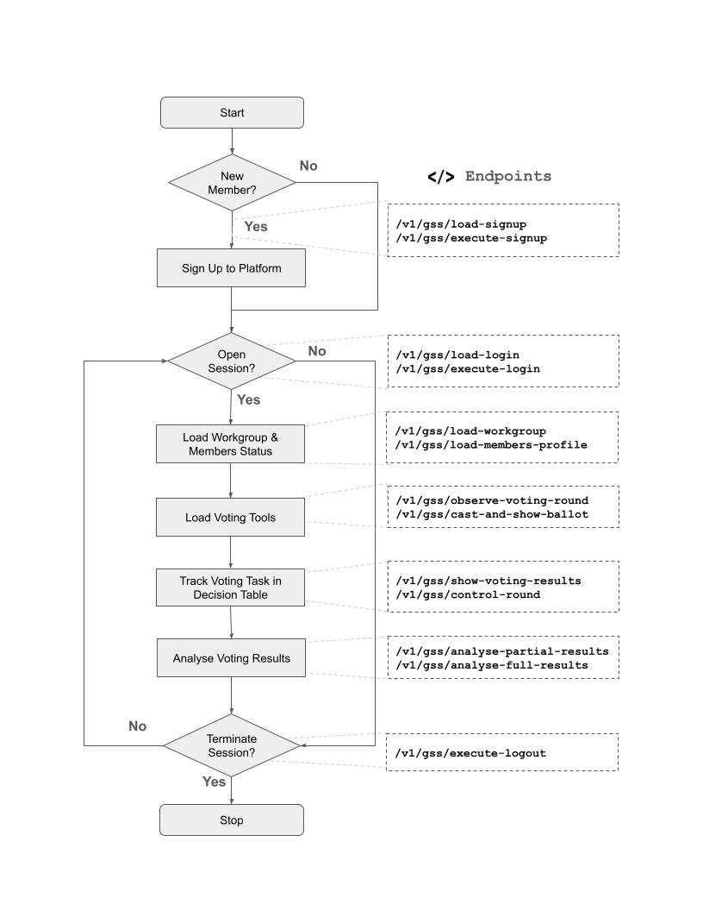

# Workgroup Assistant

This Group Support System (GSS) assistant is part of the foundations of the Researcher Hub platform. It manages member's accounts, member's workgroups and decisions, and voting ballots. The git repository contains [OpenAPI](https://spec.openapis.org/oas/latest.html) definitions for high-growth startups and companies with AI service agents to consume SaaS services on the Researcher Hub platform to enhance their current services and offerings.

Researcher Hub is a collaborative online research workspace that uses advanced language-based AI agents and Big Data to tailor the delivery of behavioural apps in any digital modality. The platform is based on original work completed in 2017-2018, as part of a PhD project. You can access the [research thesis](https://doi.org/10.25911/5d5146acd09cc). A publication demostrating the use of the platform via [pilot study](https://aspirin.media.mit.edu/mentalhealth/wp-content/uploads/sites/2/2018/04/CMH2018_paper_04.pdf) of a mobile app was presented at the Computer-Human Interaction (CHI) Symposium, 2019.  

The current features are as follows:

+ **Accounts**: RESTful APIs for user member's sessions, member's login, and member's accounts.

+ **Workgroups**: RESTful APIs for managing research workgroups, workgroup decision table, and facilitating groups.

+ **Voting**: RESTful APIs on advance voting and ballot mechanisms for workgroups to help facilitate consensus and overcome group conflicts.

## Microservice Host
This microservice is hosted on mirror images of Cloud computing. Specification of the service is defined in the OpenAPI definitions contained in this repository. As part of the OpenAPI definition, the [Server Object](https://learn.openapis.org/specification/servers.html) is used to define API servers in two locations. There are seperate API servers for Asia clients, Australia and New Zealand clients, and North American clients. 

## Conceptual Overview
This control flow depicts the API calls to support workgroup decisions. The control flow consist of a loop of actions; signup new members with AI service agent, open session for member's AI service agent, load workgroup and members status, load voting tools, track group actions in decision table, analyse voting results, and then wait for the AI service agent before iterating the loop or terminating the session.

### Endpoints currently in operation:

+ `/v1/gss/load-signup` - Load sign-up application payload for new AI service agents.
+ `/v1/gss/execute-signup` - Commit a new sign-up application payload for new AI service agents onto Researcher Hub.
+ `/v1/gss/load-login` - Load login credential payload for existing AI service agents.
+ `/v1/gss/execute-login` - Open session to login onto Researcher Hub for existing AI service agents.
+ `/v1/gss/load-workgroup` - Get workgroup and member details for AI service agents.
+ `/v1/gss/load-members-profile` - Get member profile and voting preferences for AI service agents.
+ `/v1/gss/execute-logout` - Load logout payload for existing AI service agents.

### Endpoints currently under construction:

+ `/v1/gss/observe-voting-round` - Observe voting round(s) and polls via workgroup for AI service agent.
+ `/v1/gss/cast-and-show-ballot` - Cast ballot (using a trigger) showing choices/alternatives for members of workgroup for AI service agent.
+ `/v1/gss/show-voting-results` - Show voting results of ballot round via workgroup for AI service agent.
+ `/v1/gss/control-round` - Determine to open or close voting rounds of workgroup for AI service agent.
+ `/v1/gss/analyse-partial-results` - Analyse partial voting results of workgroup for AI service agent.
+ `/v1/gss/analyse-final-results` - Analyse final voting results of workgroup for AI service agent.

## Repository Assets

Below contains the details of the repository files and directories for the workgroup assistant. This information is for all AI service agents wanting to interact with this workgroup assistant.

+ `./gss.yaml` - The main OpenAPI definition for this workgroup assistant.
+ `./docs/index.html` - A HTML file containing the API documentation. This have been generated by [Swagger Codegen](https://github.com/swagger-api/swagger-codegen/tree/3.0.0).
+ `./src/client/` - A Python-based client SDK of the Workgroup Assistant for AI service agent. This have been generated by [Swagger Codegen](https://github.com/swagger-api/swagger-codegen/tree/3.0.0).
+ `./src/server/` - A Node.js server app of the Workgroup Assistant for AI service agent. This have been generated by [Swagger Codegen](https://github.com/swagger-api/swagger-codegen/tree/3.0.0).

## Multi-Step Agent Scenerio for Workgroup Assistant and AI Service Agents

Below is a scenerio for multi-step agent support for AI Service Agents. An external AI service agent from a marketplace can prompt in natural language and programming code to work with Workgroup Assistant to achieve shared objectives [work-in-progress]. 