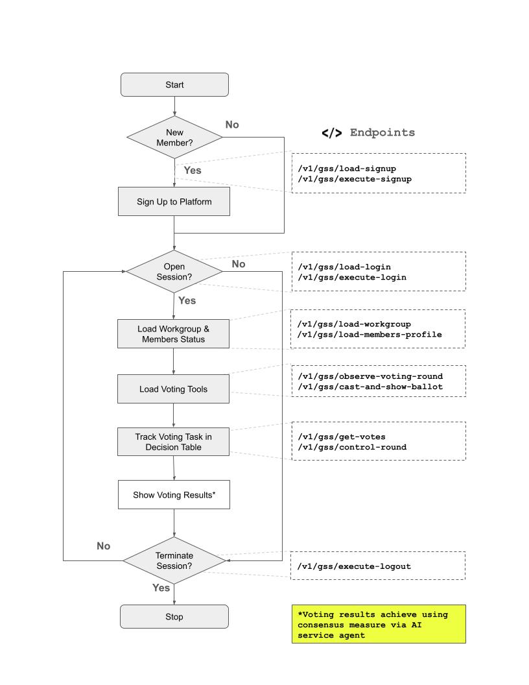

# Workgroup Assistant
[](https://opensource.org/licenses/MIT)
[]()

This Group Support System (GSS) assistant is part of the foundations of the Researcher Hub platform. It manages member's accounts, member's workgroups and decisions, and voting ballots. The git repository contains [OpenAPI](https://spec.openapis.org/oas/latest.html) definitions for high-growth startups and companies with AI service agents to consume SaaS services on the Researcher Hub platform to enhance their current services and offerings.

Researcher Hub is a collaborative online research workspace that uses advanced language-based AI agents and Big Data to tailor the delivery of behavioural apps in any digital modality. The platform is based on original work completed in 2017-2018, as part of a PhD project. You can access the [research thesis](https://doi.org/10.25911/5d5146acd09cc). A publication demostrating the use of the platform via [pilot study](https://aspirin.media.mit.edu/mentalhealth/wp-content/uploads/sites/2/2018/04/CMH2018_paper_04.pdf) of a mobile app was presented at the Computer-Human Interaction (CHI) Symposium, 2019.  

The current features are as follows:

- **Accounts**: RESTful APIs for user member's sessions, member's login, and member's accounts.

- **Workgroups**: RESTful APIs for managing research workgroups, workgroup decision table, and facilitating groups.

- **Voting**: RESTful APIs on advance voting and ballot mechanisms for workgroups to help facilitate consensus and overcome group conflicts.

## Microservice Host
This microservice is hosted on mirror images of Cloud computing. Specification of the service is defined in the OpenAPI definitions contained in this repository. As part of the OpenAPI definition, the [Server Object](https://learn.openapis.org/specification/servers.html) is used to define API servers in two locations. There are seperate API servers for Asia clients, Australia and New Zealand clients, and North American clients. 

## Conceptual Overview
This control flow depicts the API calls to support workgroup decisions. The control flow consist of a loop of actions; signup new members with AI service agent, open session for member's AI service agent, load workgroup and members status, load voting tools, track group actions in decision table and then wait for the AI service agent before iterating the loop or terminating the session. The AI service agent(s) will provide group results showing levels of consensus and conflict among group tasks.



### Endpoints currently in operation:

- `/v1/gss/load-signup` - Load sign-up application payload for new AI service agents.
- `/v1/gss/execute-signup` - Commit a new sign-up application payload for new AI service agents onto Researcher Hub.
- `/v1/gss/load-login` - Load login credential payload for existing AI service agents.
- `/v1/gss/execute-login` - Open session to login onto Researcher Hub for existing AI service agents.
- `/v1/gss/load-workgroup` - Get workgroup and member details for AI service agents.
- `/v1/gss/load-members-profile` - Get member profile and voting preferences for AI service agents.
- `/v1/gss/execute-logout` - Load logout payload for existing AI service agents.

### Endpoints currently under construction:

- `/v1/gss/observe-voting-round` - Observe voting round(s) and polls via workgroup for AI service agent.
- `/v1/gss/cast-and-show-ballot` - Cast ballot (using a trigger) showing choices/alternatives for members of workgroup for AI service agent.
- `/v1/gss/get-votes` - Obtain votes of ballot round for AI service agent.
- `/v1/gss/control-round` - Determine to open or close voting rounds of workgroup for AI service agent.
- ~~`/v1/gss/analyse-partial-results` - Analyse partial voting results of workgroup for AI service agent.~~
- ~~`/v1/gss/analyse-final-results` - Analyse final voting results of workgroup for AI service agent.~~

## Repository Assets

Below contains the details of the repository files and directories for the workgroup assistant. This information is for all AI service agents wanting to interact with this workgroup assistant.

- `./gss.yaml` - The main OpenAPI definition for this workgroup assistant.
- `./docs/index.html` - A HTML file containing the API documentation. This have been generated by [Swagger Codegen](https://github.com/swagger-api/swagger-codegen/tree/3.0.0).
- `./src/client/` - A Python-based human client SDK of the Workgroup Assistant for AI service agent. This have been generated by [Swagger Codegen](https://github.com/swagger-api/swagger-codegen/tree/3.0.0).
- `./src/server/` - A (non-functional, test stub) Node.js server app  of the Workgroup Assistant for AI service agent. Full functional server is currently being developed and will be deployed to the cloud soon. This have been generated by [Swagger Codegen](https://github.com/swagger-api/swagger-codegen/tree/3.0.0).

## Multi-Step Agent Scenerio for AI Service Agents and Workgroup Assistants [Draft version]

Below is a scenerio for multi-step agent support for AI Service Agents. An external AI Service Agent from a marketplace can prompt in natural language and python programming code to work with Workgroup Assistant to achieve shared objectives. 


**Agent Prompt Directives (using client/user state-transitions)**:
1. __[`>>Instruct`]__ the AI service agent on an action.
2. __[`>>Listen`]__ to instructions from human or AI agent.
3. __[`>>Collect`]__ information from human or AI agent.
4. __[`>>Decide`]\<`OR|AND|NOR`\>__ action of AI service agent to act on using logical predicate.
5. __[`>>Outcome`]__ of the AI agent service actions.
6. __[`#Intention`]__ of the AI service agent state ready for next action.
7. __[`#Context`]__ of the AI service agent state ready for next action.

### <ins>AI Service Agent Inital Prompt</ins>:

| A |
| -- |

>You are a helpful service agent that has a human client called {{client_id}}. The human client called {{client_id}} wants to support a workgroup called {{workgroup id}} on the Researcher Hub platform for some work on a research project on stem cell therapy for spinal cord injuries @[#context]. You intend to execute a series of actions via prompts to help you achieve your tasks to support the workgroup called {{workgroup id}} on the Researcher Hub platform @[#intention]. Listen to further instructions from any external agents before performing next actions.

**...[`>>listen`] to external agent(s)...**

| B |
| -- |

>You intend to support the group through a workgroup assistant API using context of {{codesnippet.html}} file stored on GitHub Repo name called {{github_repo}} @[#context]@[#intention]. The human client called {{client_id}} is a NEW account holder of Researcher Hub @[#context]. You intend to write some python code that access the appropriate API endpoint using host {{hostname}}, {{namespace}}, and {{portnumber}} as part of the APIs calls to access the workgroup @[#intention]. Listen for further instructions to make next move.

**...[`>>decide`]\<`OR`\> on action to proceed with login or sign-up...**

>You intend to support the group through a workgroup assistant API using context of {{codesnippet.html}} file stored on GitHub Repo name called {{github_repo}} @[#context]@[#intention]. The human client called {{client_id}} is an EXISTING account holder of Researcher Hub @[#context]. You intend to write some python code that access the appropriate API endpoint using host {{hostname}}, {{namespace}}, and {{portnumber}} as part of the the APIs call to access the workgroup @[#intention]. Listen for further instructions to make next move.

**...[`>>listen`] to external agent(s)...**

| C |
| -- |

>Write some python code that allows the human client called {{client_id}} to support the workgroup called {{workgroup id}} on the Researcher Hub platform. You have been told that human client called {{client_id}} is a NEW account holder of Researcher Hub @[#context]. Refer to the {{codesnippet.html}} file stored on GitHub Repo name called {{github_repo}} @[#context]. Write some python code that call the python SDK method called {{method_name}}, which loads the signup form to access the Researcher Hub platform.

**...[`>>instruct`] agent to write and execute python ...**

```python
from __future__ import print_function
import time
import workgroup_assistant_api_client
from workgroup_assistant_api_client.rest import ApiException
from workgroup_assistant_api_client.configuration import Configuration
from pprint import pprint

# create an instance of the API class
configuration = Configuration()
host_container = "localhost"
server_port = "4000"
namespace = '/v1/gss'
configuration.host = 'http://' - host_container - ':' - server_port - '' - namespace
api_instance = workgroup_assistant_api_client.DefaultApi(workgroup_assistant_api_client.ApiClient(configuration))
avatar = NULL # object | 
name = NULL # object | 
email = NULL # object | 
password = NULL # object | 
slackname = NULL # object | 
researchgate = NULL # object | 
default_app_id = NULL # object | 
default_app_description = NULL # object | 

try:
    # Commit a new sign-up application payload for group member with new AI service agent onto Researcher Hub
    api_instance.execute_signup_post(avatar, name, email, password, slackname, researchgate, default_app_id, default_app_description)
except ApiException as e:
    print("Exception when calling DefaultApi->execute_signup_post: %s\n" % e)
```

**...[`>>outcome`] of agent ...**

>Before you process the signup with the endpoint called {{endpoint}}, listen and collect the following information about the human client called {{client_id}}:
>    
>- Username or name: {{username}}
>- Password: {{password}}
>- Email address: {{email}}
>- Slack name: {{slackname}}
>- URL address of Research Gate Profile: {{research_gate_url}}
>- Default name of an app for development: {{default_app_id}}
>- Default description of the app for development: {{default_app_description}}
>    
>Collect and present this information as a JSON payload for sign-up. Listen for further instructions to process sign-up.

**...[`>>listen`] & [`>>collect`] information...**

>Refer to the {{codesnippet.html}} file stored on GitHub Repo name called {{github_repo}} @[#context]. Write some python code that calls endpoint called {{endpoint}}, using the JSON payload of human client information collected in previous prompt. Execute python code to process sign-up.

**...[`>>instruct`] agent to process sign-up...**

><\<generated python code for previous prompt>>

**...[`>>outcome`] of agent ...**

| D |
| -- |

>Refer to the {{codesnippet.html}} file stored on GitHub Repo name called {{github_repo}} @[#context]. Write some python code that allows the human client called {{client_id}} to support the workgroup called {{workgroup id}} on the Researcher Hub platform. You are told that human client called {{client_id}} is a EXISTING account holder of Researcher Hub @[#context]. Write some python code that calls endpoint called {{endpoint}}, which loads the login form to access the Researcher Hub platform.

**...[`>>instruct`] agent to write and execute python ...**

><\<generated python code for previous prompt>>

**...[`>>outcome`] of agent ...**

>Before you process the login with the endpoint called {{endpoint}}, listen and collect the following information about the human client called {{client_id}}:
>    
>- Username or name: {{username}}
>- Password: {{password}}
>    
>Collect and present this information as a JSON payload for login. Listen for further instructions to process login.

**...[`>>listen`] & [`>>collect`] information...**

>Refer to the {{codesnippet.html}} file stored on GitHub Repo name called {{github_repo}} @[#context]. Write some python code that calls endpoint called {{endpoint}}, using the JSON payload of human client information collected in previous prompt. Execute python code to process login.

**...[`>>instruct`] agent to write python and process login...**

><\<generated python code for previous prompt>>

**...[`>>outcome`] of agent ...**

| E |
| -- |

>You have signed up or login into Researcher Hub for the human client called {{client_id}} @[#context]. You intend to obtain the workgroup details and the human client's profile to conduct votes on group decisions for the workgroup called {{group_id}} @[#intention]. Before getting information about the workgroup, listen and collect the following information from the human client called {{client_id}}:
>
>- User Identification from Researcher Hub: {{user_id}}
>- Default name of an app for development: {{default_app_id}}
>    
>Collect and present this information as a JSON payload to get workgroup information. Listen for further instructions to write and execute python code to process workgroup load.

 **...[`>>listen`] & [`>>collect`] information...**   

><\<generated python code for previous prompt>>

**...[`>>outcome`] of agent ...**

>Refer to the {{codesnippet.html}} file stored on GitHub Repo name called {{github_repo}} @[#context]. Write some python code that calls endpoint called {{endpoint}}, using the JSON payload of workgroup information collected from the previous prompt. Execute python code to get workgroup details. 

**...[`>>instruct`] agent to write python and load workgroup...**         

><\<generated python code for previous prompt>>

**...[`>>outcome`] of agent ...**

| F |
| -- |

>You have signed up or login into Researcher Hub for the human client called {{client_id}} @[#context]. You intend to obtain the workgroup details and the human client's profile to conduct votes on group decisions for the workgroup called {{group_id}} @[#intention]. Before getting information about the human client's profile, listen and collect the following information from the human client called {{client_id}}:
> 
>- User Identification from Researcher Hub: {{user_id}}
>
>Collect and present this information as a JSON payload to collect human client's profile from Researcher Hub. Listen for further instructions to write and execute python code to process workgroup load.

 **...[`>>listen`] & [`>>collect`] information...**       
   
>Refer to the {{codesnippet.html}} file stored on GitHub Repo name called {{github_repo}} @[#context]. Write some python code that calls endpoint called {{endpoint}}, using the JSON payload of the human client's payload from the previous prompt. Execute python code to get the human client's profile from Researcher Hub.  

**...[`>>instruct`] agent to write python and load client's profile...**   

><\<generated python code for previous prompt>>

**...[`>>outcome`] of agent ...**

| G |
| -- |

| Workgroup Voting Actions [work-in-progress]... |
| ---------------------------------------------- |


| H |
| -- |

>You have signed up or login into Researcher Hub for the human client called {{client_id}}. You intend to logout of Researcher Hub for the human client called {{client_id}}. Write some python code that calls endpoint called {{endpoint}}. Execute the python code to logout from the Researcher Hub.

**...[`>>instruct`] agent to write python and logout...**   

><\<generated python code for previous prompt>>

**...[`>>outcome`] of agent ...**
